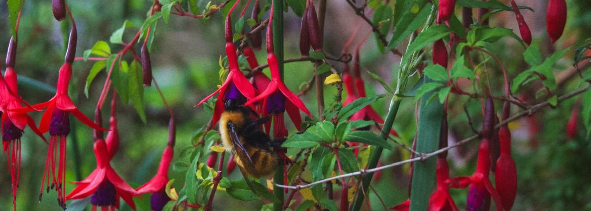
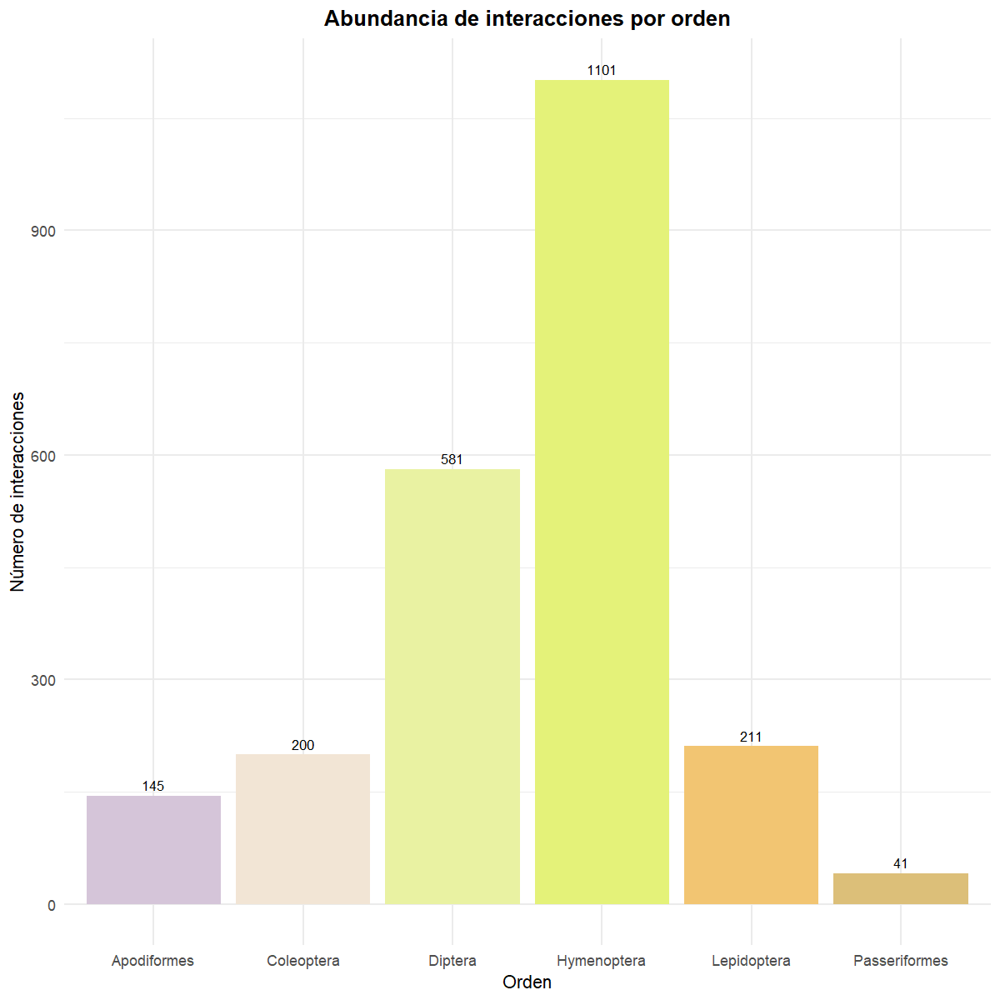
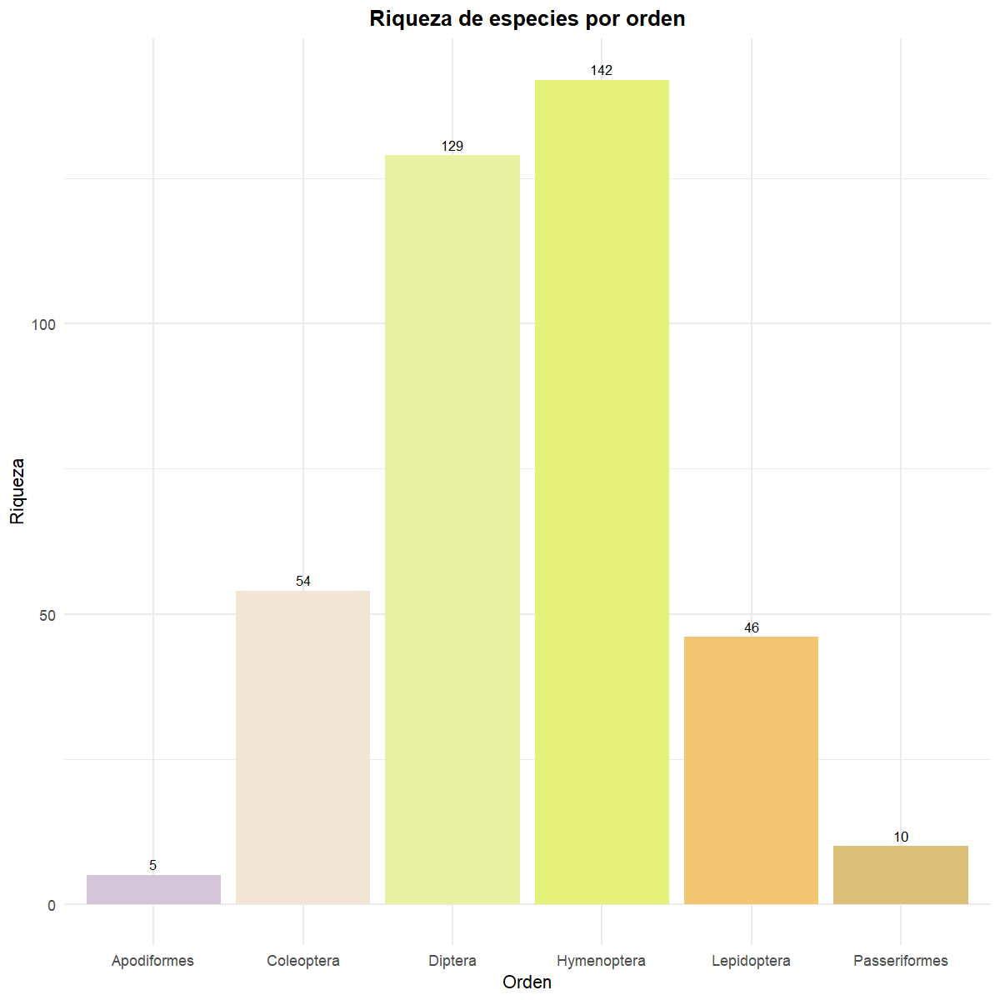
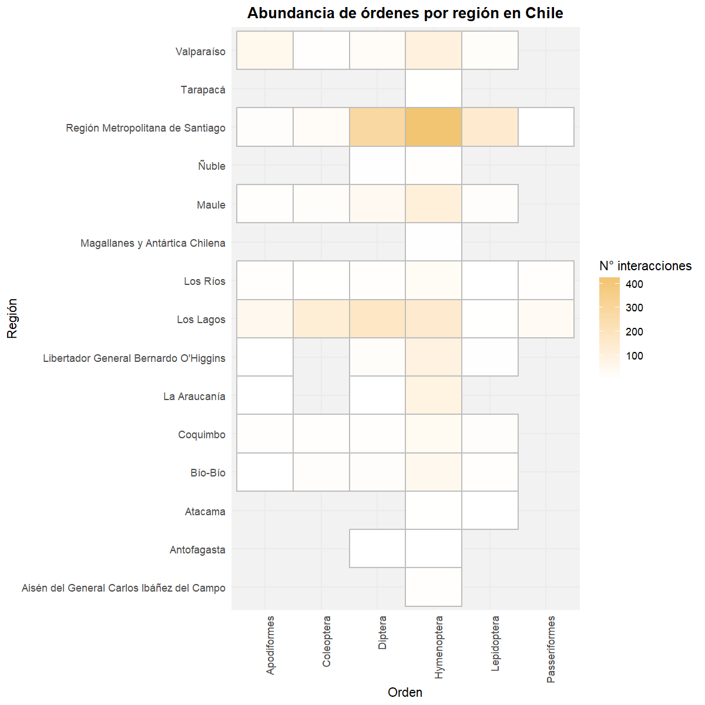

# Dominancia de órdenes de polinizadores en interacciones insecto-planta en Chile

## 🦋🐝🪲

Este proyecto analiza el Pollination catalogue de interacciones planta–polinizador con el objetivo de evaluar qué órdenes de polinizadores dominan las interacciones registradas en Chile. Utilizando herramientas de visualización en R, se describen patrones de abundancia, riqueza y distribución, integrando análisis espaciales y gráficos comparativos.

 *Bombus dahlbomii* visitando una *Fuchsia magellanica*. Fuente: Elaboración propia.

------------------------------------------------------------------------

## 🌎 Contexto

Las interacciones entre insectos polinizadores y plantas son un componente clave del funcionamiento de los ecosistemas terrestres, y en Chile se han estudiado principalmente a través de registros de observaciones de campo compilados en distintos proyectos. Entre los grupos de insectos que participan en la polinización, destacan cuatro órdenes por su frecuencia y relevancia ecológica: Hymenoptera, Diptera, Coleoptera y Lepidoptera, los cuales concentran la mayor parte de las interacciones descritas en el país (Arroyo et al., 1982; Smith-Ramírez et al., 2005).

Hymenoptera , especialmente abejas nativas e introducidas, suele ser el grupo dominante en estudios de polinización debido a su alta eficiencia, comportamiento de búsqueda y fidelidad floral (Michener, 2007). Sin embargo, otros órdenes como Diptera (moscas), Lepidoptera (mariposas) y Coleoptera (escarabajos) también cumplen roles importantes en determinados ambientes y plantas, contribuyendo a redes de interacción más diversas de lo que comúnmente se asume.

El Pollination Catalogue reúne miles de registros publicados de interacciones insecto–planta entre 1982 y 2019, ofreciendo una oportunidad para explorar patrones de dominancia, riqueza y abundancia entre órdenes a escala nacional. Este proyecto utiliza dicho catálogo para visualizar cómo se distribuyen estas interacciones y evaluar qué orden de polinizadores registra la mayor actividad en Chile.

------------------------------------------------------------------------

## 📁 Datos

Los datos utilizados en este proyecto provienen del *Pollination catalogue*, creado por Giselle Muschett & Francisco E. Fontúrbel. Este catálogo recopiló datos de interacciones planta-polinizador en Chile desde 1982 a 2019.

*Fuente:* [Pollination Catalogue - Fonturbel Lab](https://github.com/fonturbel-lab/pollination_catalogue/tree/master)

El dataset incluye información sobre:

-   Especies de plantas (*scientific_name_plants*)
-   Especies de animales polinizadores (*scientific_name_animals*)
-   Órdenes taxonómicos (*order_animals*)
-   Ubicación geográfica (*state_province*)

*Órdenes analizados:* Hymenoptera, Diptera, Lepidoptera, Coleoptera, Apodiformes, Passeriformes

------------------------------------------------------------------------

## 🎯 Objetivos

Describir y visualizar la dominancia de los principales órdenes de polinizadores en las interacciones planta–polinizador registradas en Chile.

------------------------------------------------------------------------

## 📂 Estructura del Repositorio

```         
interaccion_polinizadores_chile/
│
├── dataset/                      
│   └── pollination_catalogue.csv
│
├── img/                          
│   └── bombus.jpg
│
├── plots/                       
│
├── scr/                        
│   ├── 01-Cargar datos.R
│   ├── 02-Filtrar y explorar datos.R
│   ├── 03-Gráficos.R
│   └── 04-Mapas.R
│
├── .gitignore                    
├── interaction_polinizadores_chile.Rproj  
└── README.md                     
```

------------------------------------------------------------------------

## 📦 Procesamiento de datos

### Paquetes utilizados

| Paquete             | Objetivo                                   |
|---------------------|--------------------------------------------|
| `tidyverse`         | Manipulación y transformación de datos     |
| `janitor`           | Limpieza de nombres de columnas            |
| `ggplot2`           | Creación de gráficos                       |
| `patchwork`         | Combinación de múltiples gráficos          |
| `rnaturalearth`     | Obtención de datos geoespaciales           |
| `rnaturalearthdata` | Mapas base de países                       |
| `sf`                | Manejo y visualización de datos espaciales |

### Preparación y exploración de datos

Para el análisis de los datos, se filtró el *Pollination catalogue* para conservar únicamente los órdenes de polinizadores considerados en este estudio, y se estandarizaron los nombres de las regiones para facilitar los análisis posteriores. Luego, se realizó una exploración inicial que incluyó:

-   Abundancia de interacciones por orden
-   Riqueza de especies por orden
-   Abundancia de ordenes por region
-   Plantas con mayor numero de interacciones en Chile

Finalmente, se generaron visualizaciones mediante gráficos de barras, heatmaps y mapas de abundancia a nivel nacional.

------------------------------------------------------------------------

## 📊 Resultados

A continuacion se presentan los resultados obtenidos del análisis.

### Figura 1: *Abundancia de interacciones por orden*

El gráfico muestra el número total de interacciones registradas para cada orden de polinizadores en Chile. Se observa una marcada dominancia del orden Hymenoptera, con más de 1100 interacciones, seguido por Diptera, que supera las 580. En contraste, Coleoptera, Lepidoptera, Apodiformes y Passeriformes presentan valores considerablemente menores.

### Figura 2: *Riqueza de especies por orden*

El gráfico muestra la cantidad de especies de polinizadores registradas dentro de cada orden. Hymenoptera nuevamente destaca como el grupo más diverso, con 142 especies, seguido de Diptera, que alcanza 129. Coleoptera y Lepidoptera presentan niveles intermedios de riqueza, mientras que Apodiformes y Passeriformes muestran valores muy bajos.

### Figura 3: *Abundancia de ordenes por región*

El heatmap muestra cómo se distribuyen las interacciones de los diferentes órdenes de polinizadores entre las regiones de Chile. Hymenoptera destaca como el orden con mayor presencia y abundancia en varias regiones, especialmente en la Región Metropolitana y Los Lagos, mientras que Diptera presenta valores moderados y una distribución más amplia. Los demás órdenes exhiben abundancias bajas y presencia más limitada.

### Figura 4: *Especies de insectos y plantas con mayor interacciones*


### Figura 5: *Mapa abundancia por región*


------------------------------------------------------------------------

## 📝 Conclusiones

Aqui van las conclu

------------------------------------------------------------------------

## 🎓 Audiencia

------------------------------------------------------------------------

## 💻 Declaración de uso de inteligencia artificial generativa

La autora recurrió a las herramientas ChatGPT y Claude como apoyo en la corrección y optimización de algunos scripts utilizados durante el procesamiento y visualización de los datos.

------------------------------------------------------------------------

## 🌷 Autor

------------------------------------------------------------------------

## 📖 Referencias

Arroyo, M. T. K., Primack, R. B., & Armesto, J. J. (1982). Community studies in pollination ecology in the high temperate Andes of central Chile. American Journal of Botany, 69(1), 82–97. <https://doi.org/10.1002/j.1537-2197.1982.tb13237.x>

Arroyo, M. T. K., Marquet, P., Marticorena, C., Simonetti, J., & Cavieres, L. (2006). The Mediterranean-type climate region of central Chile. In The physical geography of South America (pp. 195–232). Oxford University Press.

Michener, C. D. (2007). The bees of the world (2nd ed.). Johns Hopkins University Press.

Muschett, G., & Fontúrbel, F. E. (2021). Pollination Catalogue (Data set). Fontúrbel Lab. <https://github.com/fonturbel-lab/pollination_catalogue>

Myers, N., Mittermeier, R. A., Mittermeier, C. G., da Fonseca, G. A., & Kent, J. (2000). Biodiversity hotspots for conservation priorities. Nature, 403(6772), 853–858. <https://doi.org/10.1038/35002501>

Smith-Ramírez, C., Armesto, J. J., & Gutiérrez, J. R. (2005). Historia natural y conservación de los mutualismos planta–animal del bosque templado de Sudamérica austral. Revista Chilena de Historia Natural, 78(1), 55–81.
